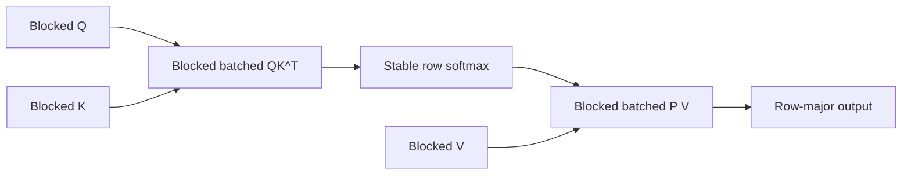

# Helion MLIR CPU Attention: Prototyping Findings and Future Work

This document records the investigation into a Helion MLIR CPU implementation
of KernelBench level1/97 scaled dot-product attention. No production kernel or
`mlir-cpu-bench` variant was shipped because none of the explored designs was
both functional and competitive with PyTorch eager. All prototypes and logs
remain under `temp/` as starting points for future work.

The reference operation is:

```python
torch.nn.functional.scaled_dot_product_attention(Q, K, V)
```

for tensors shaped `[batch, heads, sequence, head_dimension]`, without a mask,
dropout, causal mode, or grouped-query attention.

The intended computation is:

$$
S = \frac{QK^T}{\sqrt{D}}, \qquad
P = \operatorname{softmax}(S), \qquad
O = PV.
$$

Relevant source files:

- Reference model: `AI-bench/third_party/KernelBench/KernelBench/level1/97_ScaledDotProductAttention.py`
- Existing problem spec: `AI-bench/problems/specs/KernelBench/level1/97_ScaledDotProductAttention.yaml`
- Triton CPU implementation: `AI-bench/backends/triton/cpu/KernelBench/level1/97_ScaledDotProductAttention.py`
- Helion GPU-oriented inspiration: `helion/examples/flex_attention.py`

## Executive Summary

The investigation established the following:

1. PyTorch eager CPU attention is already highly optimized and is a demanding
   baseline. A useful implementation must batch heads and avoid materializing
   unnecessary intermediates.
2. A per-head composition of existing 2D AMX matmul helpers is numerically
   correct, but far too slow because it serializes heads and launches several
   kernels per head.
3. A FlashAttention-style Helion kernel is expressible at the source level, but
   the current MLIR backend does not lower `hl.dot`, and its generic ATen
   reduction/broadcast metadata is not robust for tiled loop-local tensors.
4. The backend can execute a blocked rank-5 batched AMX contraction. This is the
   most promising primitive for attention.
5. A two-kernel design using blocked batched `QK^T` followed by fused
   softmax+`PV` reached semantically meaningful lowering, but Lighthouse
   transform compilation exceeded 120 seconds even after reducing the output
   tile to one 32-column block.
6. Several experimental compiler lowerings were tried during debugging. They
   were removed after audit because they either relied on unsafe shape
   heuristics or aborted under the optimized pipeline. The backend compiler
   files were restored to their pre-investigation state.

The recommended future direction is a dedicated blocked attention operation or
pipeline schedule, not further composition of independent 2D matmul calls.

## Eager CPU Baseline

Measurements used bf16 inputs, `OMP_NUM_THREADS=4`, three warmups, ten timed
calls, and `time.perf_counter()`. Approximate FLOPs use
`4 * B * H * S * S * D`, accounting for `QK^T` and `PV` only.

| Shape `[B,H,S,D]` | Median eager time | Approximate throughput |
|---|---:|---:|
| `[2,8,128,128]` | 0.140 ms | 958.5 GFLOPS |
| `[2,8,256,128]` | 0.423 ms | 1270.6 GFLOPS |
| `[4,8,256,128]` | 0.849 ms | 1264.4 GFLOPS |
| `[32,32,64,128]` | 3.731 ms | 575.6 GFLOPS |

These results were used to bound prototype runs. Individual compilation tests
were generally capped at 45-120 seconds. A prototype exceeding those limits on
tiny shapes was considered non-viable.

A representative eager benchmark script is:

```python
import statistics
import time

import torch
import torch.nn.functional as F

B, H, S, D = 2, 8, 256, 128
q = torch.randn(B, H, S, D, dtype=torch.bfloat16)
k = torch.randn_like(q)
v = torch.randn_like(q)

for _ in range(3):
    F.scaled_dot_product_attention(q, k, v)

times = []
for _ in range(10):
    start = time.perf_counter()
    F.scaled_dot_product_attention(q, k, v)
    times.append(time.perf_counter() - start)

print(statistics.median(times) * 1e3, "ms")
```

## Design 1: Direct FlashAttention-Style Kernel

The first approach adapted `helion/examples/flex_attention.py` to dense CPU
attention. It kept online softmax state for each query row:

```python
row_max = -inf
row_sum = 1
acc = 0

for key_block:
    scores = Q_block @ K_block.T * scale
    new_max = maximum(row_max, amax(scores, dim=-1))
    probabilities = exp(scores - new_max[:, None])
    correction = exp(row_max - new_max)
    row_sum = row_sum * correction + sum(probabilities, dim=-1)
    acc = acc * correction[:, None] + probabilities @ V_block
    row_max = new_max

out = acc / row_sum[:, None]
```

Primary prototype:

- `temp/prototype_attention_mlir.py`

Representative logs:

- `temp/prototype_attention_1x1x32x32.txt`
- `temp/prototype_attention_1x1x32x32_v2.txt`
- `temp/prototype_attention_flattened.txt`

### Finding 1: `hl.dot` Is Not Lowered by the MLIR Backend

The GPU example uses `hl.dot` for both contractions. The MLIR backend reports:

```text
Unsupported operation: dot
Reason: Not a helion-specific op or a recognised ATen op
```

Replacing `hl.dot` with the backend's proven AMX recognition pattern:

```python
acc = hl.zeros([...], dtype=torch.float32)
acc = acc + torch.einsum(...)
```

moves compilation further, but does not by itself make the direct kernel
work. This pattern remains mandatory: omitting the f32 accumulator causes a
bf16-output contraction that Lighthouse does not map to AMX.

### Finding 2: Dynamic Local Initialization Is Fragile

The following source forms produced dynamic `aten.full` helpers whose tile-size
symbols were not bound:

```python
row_max = torch.full([tile_m], float("-inf"), dtype=torch.float32)
row_sum = torch.zeros([tile_m], dtype=torch.float32)
```

The Helion-native equivalents are preferable:

```python
row_max = hl.full([tile_m], float("-inf"), dtype=torch.float32)
row_sum = hl.full([tile_m], 1.0, dtype=torch.float32)
```

This fixed one frontend/helper-import failure but exposed later issues.

### Finding 3: Loop-Carried State Requires Exact Shape Stability

Online softmax updates `row_max`, `row_sum`, and `acc` inside a key-block loop.
Helion rejects loop-carried tensors when one iteration is inferred with a
literal unit dimension and another with a symbolic tile dimension:

```text
ControlFlowTensorMismatch: size [u2, u3, 1, 32] != [u2, u3, u4, 32]
```

Using scalar `hl.grid` indices can make local shapes statically fixed, but this
reduces available parallelism and can leave OpenMP operations unlowered by the
optimized pipeline.

### Finding 4: Multiple Reduction Dimensions Are Rejected

Keeping a one-element key-block tile axis and reducing over both key-block and
within-block dimensions fails in Helion before MLIR generation:

```text
NotImplementedError: multiple reduction dimensions
```

The operation must be restructured into sequential single-dimension reductions
or avoid carrying a key-block tile axis.

## Design 2: Materialized Scores With Fused Softmax+PV

The Triton CPU kernel materializes `[BH,S,S]` scores in one kernel, then performs
online softmax and `PV` in a second kernel. A similar Helion design was explored
with full-key query blocks.

Primary prototype:

- `temp/prototype_attention_full_keys.py`

Representative logs:

- `temp/prototype_attention_full_keys_64x128.txt`
- `temp/prototype_attention_full_keys_64x128_v2.txt`
- `temp/prototype_attention_full_keys_broadcast_fix.txt`
- `temp/prototype_attention_full_keys_generic_broadcast.txt`
- `temp/prototype_attention_full_keys_parallel.txt`
- `temp/prototype_attention_lowered_dump.txt`

### Finding 5: Reduction Results Can Carry Stale Tile Metadata

For a score tensor with actual call-site type similar to:

```text
tensor<1x2x32x64xf32>
```

`torch.amax(scores, dim=-1)` was inferred with unrelated full/hint extents such
as `tensor<64x64x32xf32>`. Subsequent row broadcasting then failed helper
signature checks:

```text
ATen helper signature does not match operand types
['tensor<1x2x32x64xf32>', 'tensor<64x64x32x1xf32>']
```

This is a general limitation in how generic ATen reduction helpers are built
from pre-codegen FX metadata rather than concrete MLIR operand types.

### Finding 6: Explicit `expand_as` Is Not a Workaround

Materializing row broadcasts explicitly:

```python
row_max[:, None].expand_as(scores)
```

reached Lighthouse but aborted in native MLIR subview inference:

```text
MemRefOps.cpp: inferResultType
Assertion `staticSizes.size() == rank` failed
```

Therefore, explicit tensor expansion should not be used as a workaround until
Lighthouse's tiled subview handling is fixed.

### Finding 7: Direct Broadcast/Reduction Lowerings Need Pipeline Support

Experimental direct lowerings to `linalg.reduce` and a broadcasted
`linalg.generic` worked numerically under the scalar pipeline. Under
`HELION_MLIR_PIPELINE=1`, a focused reduction+broadcast probe aborted inside
Lighthouse's tile-and-fuse transform:

```text
LinalgTransformOps.cpp: applyTilingToAll
Assertion `tiledResults->loops.size() == numLoops` failed
```

Probe:

- `temp/probe_compiler_generalizations.py`

These compiler changes were removed. They must not be reintroduced without:

1. Scalar and optimized-pipeline numerical tests.
2. Transform-level regression coverage in Lighthouse.
3. Tests for rank-2 and higher-rank unit-dimension broadcasting.
4. Boundary/ragged tile coverage.

## Design 3: Composition From Existing 2D AMX Matmuls

A correctness-first composition used only proven 2D matmul helpers:

1. `Q @ K.T` with fused exponentiation.
2. AMX projection matmul to compute row sums.
3. `V.T @ P.T` for the numerator.
4. Identity AMX affine matmul to apply reciprocal row sums.

Prototype:

- `temp/prototype_attention_composed.py`

Logs:

- `temp/prototype_attention_composed_32.txt`
- `temp/prototype_attention_composed_64x128.txt`

At `[B,H,S,D] = [1,1,64,128]`:

```text
max_diff = 0.00390625
mean_diff = 0.00054204
warm time = 2.3319 ms
```

The result is numerically correct but not competitive. Eager processes many
heads in less time than this implementation takes for one head. The causes are:

- Python loops over batch and heads.
- Multiple kernel launches per head.
- Materialized score/probability tensors.
- Extra AMX matmuls used to emulate reductions and normalization.

This path is useful as a numerical reference, not as a deployable kernel.

## Design 4: Blocked Batched Two-Kernel Attention

This was the most promising design:

1. Pack Q, K, and V into 32x32 AMX layouts.
2. Run a proven rank-5 blocked batched `QK^T` contraction.
3. Keep scores in `[BH, query_blocks, key_blocks, 32, 32]` form.
4. Perform stable softmax over key blocks and within-block keys.
5. Contract probabilities with packed V in a second blocked batched kernel.

Prototype:

- `temp/prototype_attention_two_kernel.py`

Representative logs:

- `temp/prototype_attention_two_kernel_64x128.txt`
- `temp/prototype_attention_two_kernel_no_reshape.txt`
- `temp/prototype_attention_two_kernel_reshape_fix.txt`
- `temp/prototype_attention_two_kernel_reshape_fix_v2.txt`
- `temp/prototype_attention_two_kernel_source_fix.txt`
- `temp/prototype_attention_two_kernel_bd1.txt`

### Finding 8: Blocked Batched AMX Contraction Works

The existing prototype below remains a valuable anchor:

- `temp/probe_bmm_kernel.py`

It packs rank-3 batched matrices into rank-5 blocked layouts and performs:

```python
acc = hl.zeros([batch, mb, nb, 32, 32], dtype=torch.float32)
acc = acc + torch.einsum(
    "sakmc,sbkcn->sabmn",
    packed_a,
    packed_b,
)
```

This executes correctly under the optimized pipeline. Future attention work
should preserve this exact contraction representation rather than relying on a
raw rank-3 `linalg.batch_matmul` emitted from unblocked operands.

### Finding 9: Local Reshapes With Symbolic Tile Prefixes Do Not Import

Reshaping a local score tile from blocked to row-major form generated helpers
with unresolved tile symbols:

```text
Could not import ATen node 'rows' (aten.view.default):
FX Node block_size_0 has not been bound to an MLIR value
```

Attempts to infer target leading dimensions from source MLIR types became
heuristic and were removed after review. A proper solution should represent
blocked softmax directly or introduce an explicit backend operation for a
blocked-to-row view with verified indexing semantics.

### Finding 10: Compilation Time Remains Prohibitive

After removing local reshapes and expressing softmax directly over blocked
scores, Lighthouse transform compilation exceeded 120 seconds for only:

```text
B=1, H=1, S=64, D=128
```

Reducing the `PV` output tile from all four 32-column blocks to one block still
exceeded the 120-second cap. Log:

- `temp/prototype_attention_two_kernel_bd1.txt`

This indicates transform/schedule complexity rather than runtime workload. The
current generic matmul pipeline is not a suitable schedule for a fused region
containing two blocked contractions, reductions, exponentials, broadcasts, and
normalization.

## Batched Contraction Pipeline Findings

A raw rank-3 batched einsum or matmul lowered through the existing optimized
pipeline can leave array-to-vector and vector-to-array casts in LLVM-level IR:

```text
builtin.unrealized_conversion_cast
  !llvm.array<32 x vector<16xbf16>> to vector<32x16xbf16>
```

and:

```text
vector<1x16x16xf32> to !llvm.array<1 x array<16 x vector<16xf32>>>
```

These were captured in:

- `temp/prototype_attention_lowered_dump.txt`

Lighthouse contains a nominal AMX bf16 batch-matmul descriptor:

- `lighthouse/lighthouse/pipeline/descriptors/x86_64/amx_bf16/batch_matmul/bf16.yaml`

Using it directly did not solve the generalized attention contractions and left
OpenMP operations untranslated. Log:

- `temp/prototype_attention_batch_pipeline.txt`

The descriptor may still be useful for a canonical `linalg.batch_matmul`, but
attention's generalized blocked `linalg.contract` requires dedicated handling.

## Compiler Changes Audited and Removed

Attention prototyping temporarily explored the following backend changes:

- `HELION_MLIR_PIPELINE_DESCRIPTOR` environment override.
- Direct last-dimension `sum` and `amax` lowering.
- Direct same-rank unit-dimension broadcast arithmetic.
- Heuristic repair of static reshape target shapes.
- Concrete-shape unsqueeze/subscript inference.

After review:

- The pipeline override had no validated production user.
- Reduction+broadcast lowering aborted under the optimized pipeline.
- Reshape repair could silently choose an unintended layout.
- Subscript changes were not needed by a working attention design.

All were removed. The relevant compiler files match their pre-investigation
state, and the full backend suite passed afterward.

Validation after rollback:

```text
Ruff: passed
Focused execution/reduction tests: 110 passed, 1 skipped
Full HELION_MLIR_PIPELINE=1 suite: 283 passed, 1 skipped
```

## Recommended Future Architecture

A performant implementation should use a dedicated attention lowering and
schedule rather than tracing all operations as unrelated generic ATen helpers.

Recommended tensor-level structure:



The implementation should:

- Flatten batch and heads to `BH` for scheduling.
- Use 32x32 bf16 AMX blocks and f32 accumulators.
- Tile query rows by 32.
- Stream key blocks with online max/sum state when sequence length is large.
- Fuse `PV` into the same scheduled region to avoid writing probabilities.
- Parallelize across `(BH, query_block)`.
- Keep reduction state in vectors/registers, not tensor helpers generated from
  stale FX metadata.
- Handle sequence tails explicitly; do not rely on clamping loads for padding.

## Prioritized Future Work

### 1. Add a First-Class Blocked Attention Operation

Introduce a backend-recognized operation carrying:

- Q/K/V blocked operands.
- Scale.
- Query/key block sizes.
- Optional mask metadata in the future.

Lower it directly to a controlled Linalg region or a Lighthouse attention
payload. This avoids generic ATen helper construction for reductions and row
broadcasts.

### 2. Add a Lighthouse CPU Attention Schedule

The schedule should recognize the two contraction anchors and explicitly:

1. Tile `PV` over `(BH, M, D)`.
2. Fuse score generation for the required query/key tiles.
3. Keep row max and row sum as vector reductions.
4. Apply AMX register tiling independently to `QK^T` and `PV`.
5. Lower all OpenMP loops before LLVM translation.
6. Eliminate array↔vector unrealized casts around batched contracts.

Lighthouse's GPU fused-attention work can provide structural inspiration:

- `lighthouse/lighthouse/schedule/xegpu/fused_attention_schedule.py`
- `lighthouse/lighthouse/ingress/mlir_gen/gpu_attention_payload.py`
- `lighthouse/examples/xegpu/nanoGPT_schedule.py`

### 3. Fix Generic Reduction Metadata Separately

If generic reductions remain desirable, result types must be derived from the
actual MLIR operand at the call site, not only pre-codegen FX metadata. Required
tests include:

- Last-dimension sum and max.
- Rank 2 through rank 5.
- Tile sizes smaller than, equal to, and larger than 64.
- Boundary/ragged tiles.
- `keepdim=False` followed by unsqueeze.
- Scalar and optimized pipelines.
- Lighthouse transform tests proving tile-and-fuse does not assert.

Do not consider scalar-pipeline correctness sufficient: the experimental direct
lowering passed scalar execution but aborted in the optimized pipeline.

### 4. Fix Batched Vector Contract Conversion

Create a minimal pure-MLIR reproducer from the unresolved casts in
`temp/prototype_attention_lowered_dump.txt`. The desired outcome is either:

- Proper vector-to-LLVM conversion for batched vector shapes, or
- A register-tiling schedule that lowers the batch dimension before vector
  conversion.

### 5. Reintroduce a KernelBench Variant Only After Performance Qualification

Suggested initial bf16 variant:

```yaml
mlir-cpu-bench:
  - params: [Q, K, V]
    dtype: bfloat16
    dims:
      BATCH_SIZE: 2
      NUM_HEADS: 8
      SEQUENCE_LENGTH: 256
      EMBEDDING_DIMENSION: 128
    rtol: 2.e-2
    atol: 2.e-2
```

Performance gates:

- Compilation should complete in under 30 seconds on the shared development
  node for the first shape specialization.
- Warm execution should be within 2x eager before the kernel is added to the
  benchmark suite.
- The long-term target should be competitive with eager by avoiding score and
  probability materialization.

Correctness gates:

- Compare against `scaled_dot_product_attention` on random bf16 values.
- Include large-magnitude values to exercise stable softmax.
- Test sequence lengths 32, 64, 128, and 256.
- Add non-multiple-of-32 sequence coverage only after explicit masking is
  implemented.
- Verify each row sums to approximately one before `PV` in a debug variant.

## Reproduction Commands

Run from `AI-bench/` with low shared-node parallelism:

```bash
# Correct but slow per-head composition
OMP_NUM_THREADS=4 HELION_MLIR_PIPELINE=1 \
LD_PRELOAD=/lib64/libtcmalloc.so \
uv run python ../temp/prototype_attention_composed.py 1 1 64 128

# Direct FlashAttention-style experiments
OMP_NUM_THREADS=4 HELION_MLIR_PIPELINE=1 \
LD_PRELOAD=/lib64/libtcmalloc.so \
uv run python ../temp/prototype_attention_mlir.py 1 1 32 32

# Full-key fused prototype
OMP_NUM_THREADS=4 HELION_MLIR_PIPELINE=1 \
LD_PRELOAD=/lib64/libtcmalloc.so \
uv run python ../temp/prototype_attention_full_keys.py 1 1 64 128

# Most promising two-kernel blocked prototype
OMP_NUM_THREADS=4 HELION_MLIR_PIPELINE=1 \
LD_PRELOAD=/lib64/libtcmalloc.so \
uv run python ../temp/prototype_attention_two_kernel.py 1 1 64 128

# Proven blocked batched AMX contraction anchor
OMP_NUM_THREADS=4 HELION_MLIR_PIPELINE=1 \
LD_PRELOAD=/lib64/libtcmalloc.so \
uv run python ../temp/probe_bmm_kernel.py
```

Always apply a timeout while iterating, for example:

```bash
timeout 120 env OMP_NUM_THREADS=4 HELION_MLIR_PIPELINE=1 \
LD_PRELOAD=/lib64/libtcmalloc.so \
uv run python ../temp/prototype_attention_two_kernel.py 1 1 64 128
```

## Final Status

Attention is not shipped for Helion MLIR CPU. The investigation produced:

- Reliable eager baselines.
- A numerically correct but slow composed reference.
- A proven blocked batched AMX contraction primitive.
- Several minimized backend/pipeline failure modes.
- Preserved source and log artifacts for each attempted design.
- A clear path toward a first-class blocked attention operation and dedicated
  Lighthouse CPU schedule.

The key lesson is that attention cannot be made competitive by simply composing
existing 2D matmul helpers or tracing GPU-oriented source through the generic
ATen bridge. It needs explicit compiler ownership of batched contractions,
row-wise reductions, broadcasts, and fusion.
